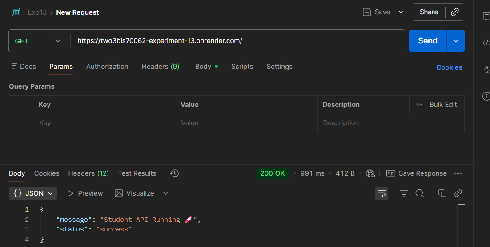
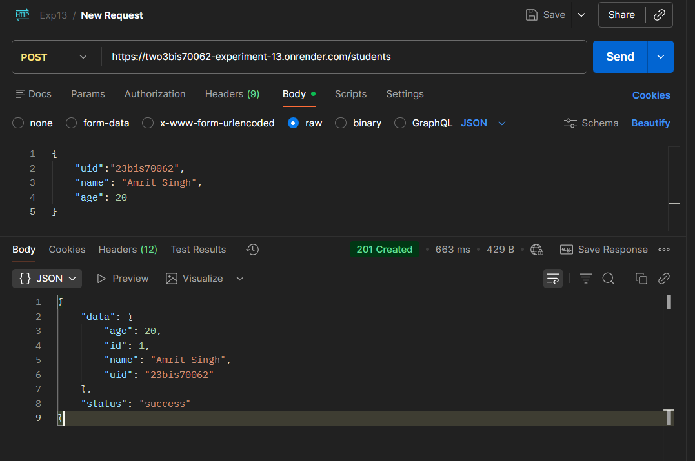
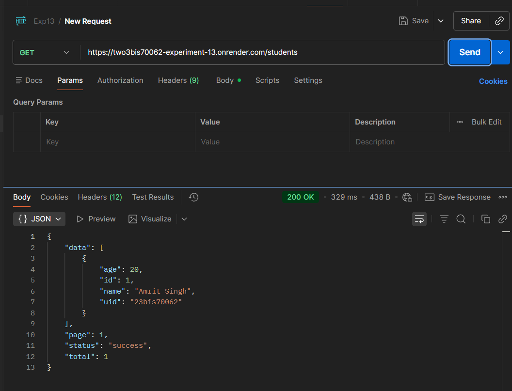
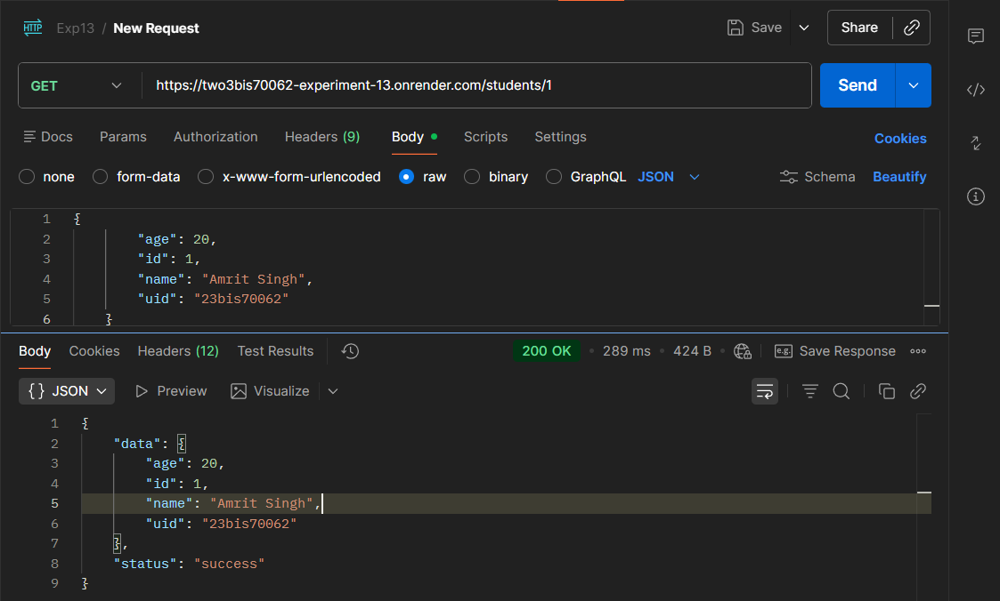
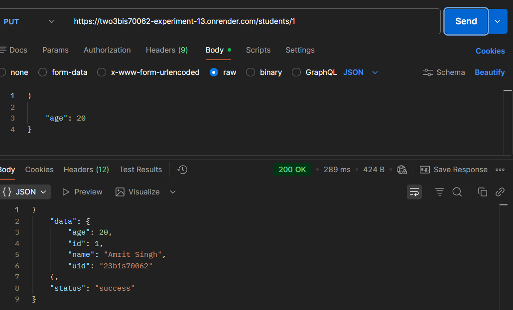
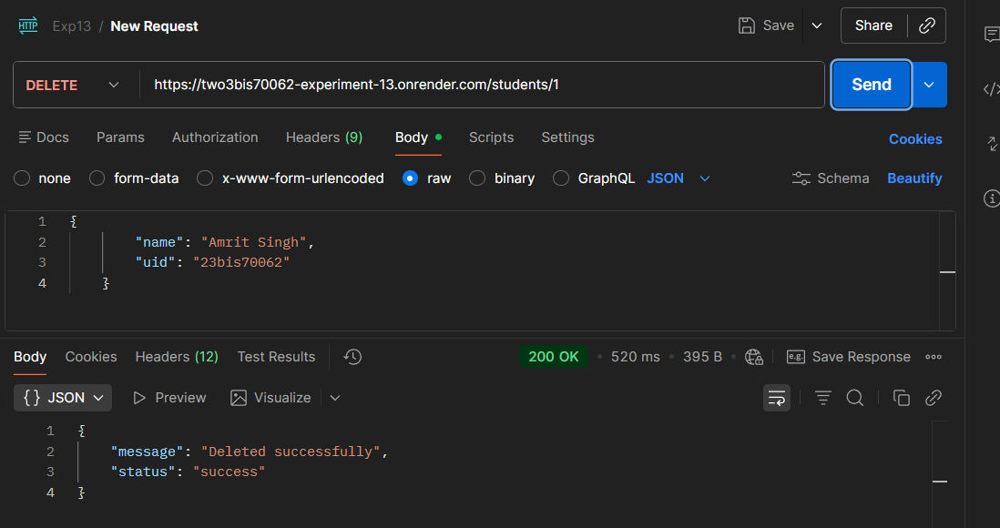
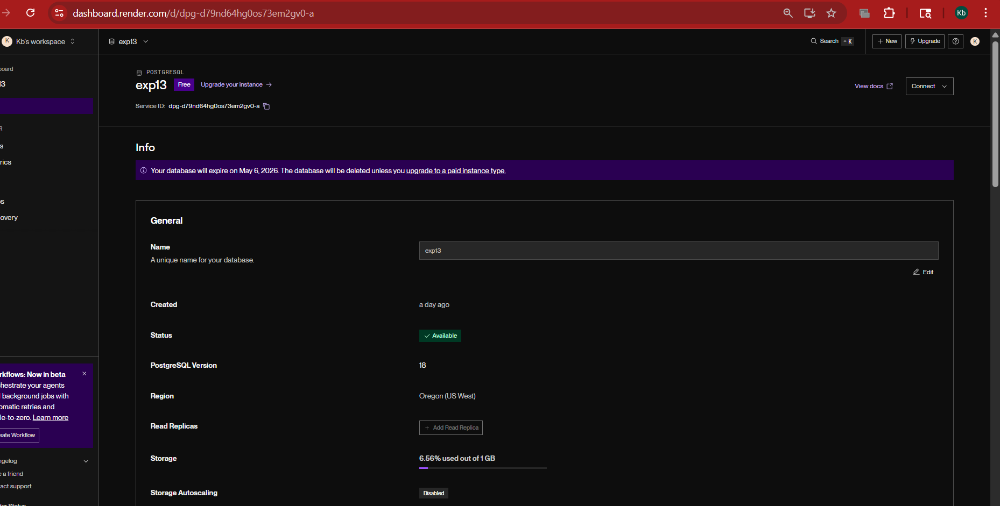
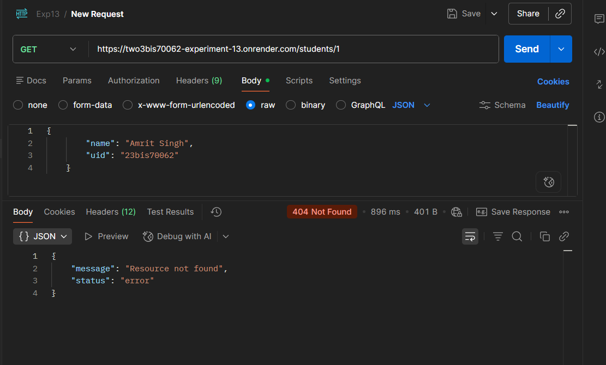

# 🎓 Student Management REST API (Flask + PostgreSQL)

A production-ready REST API built using **Flask**, **SQLAlchemy**, and **Marshmallow** for managing student records.
This API supports full CRUD operations, validation, pagination, and is deployable on platforms like **Render**.

---

## 🚀 Features

- ✅ RESTful API design
- ✅ CRUD operations (Create, Read, Update, Delete)
- ✅ Input validation using Marshmallow
- ✅ PostgreSQL support (Render-ready)
- ✅ SQLite fallback for local testing
- ✅ Pagination support
- ✅ Structured error handling
- ✅ Health check endpoint
- ✅ Production-ready configuration

---

## 🛠️ Tech Stack

- **Backend:** Flask
- **Database:** PostgreSQL / SQLite
- **ORM:** SQLAlchemy
- **Validation:** Marshmallow
- **Server:** Gunicorn

---

## 📂 Project Structure

```
.
├── app.py
├── requirements.txt
├── runtime.txt
└── README.md
```

---

## ⚙️ Installation & Setup

### 🔹 1. Clone Repository

```
git clone https://github.com/Amrit08-dot/student-api.git
cd student-api
```

---

### 🔹 2. Create Virtual Environment

```
python -m venv venv
venv\Scripts\activate      # Windows
```

---

### 🔹 3. Install Dependencies

```
pip install -r requirements.txt
```

---

## 📌 API Endpoints

### 🔹 Base URL

https://two3bis70062-experiment-13.onrender.com/

### 🟢 1. Checking working of the backend



### 🟢 2. Create Student



### 🟢 3. Getting All Students



### 🟢 4. Get Single Student



### 🟢 5. Update Student



### 🟢 6. Delete Student



## 🔒 Validation Rules

- **Name:** Minimum 2 characters
- **Age:** 1–120
- **UID:** Minimum 3 characters, unique

---

## Database



## ⚠️ Error Handling

- `400` → Validation / Duplicate UID
- `404` → Resource not found
- `500` → Server error

Example:



## 🚀 Deployment (Render)

### 🔹 Start Command

```
gunicorn app:app
```

### 🔹 runtime.txt

```
python-3.11.9
```

### 🔹 requirements.txt (important)

```
flask
gunicorn
sqlalchemy
marshmallow
psycopg2-binary
setuptools
```

---

## 🧠 Key Concepts Implemented

- REST API Design
- ORM (SQLAlchemy)
- Data Validation (Marshmallow)
- Pagination
- Error Handling
- Environment-based configuration

---

## 📈 Future Improvements

- 🔐 JWT Authentication
- 👤 User roles & authorization
- 📊 Logging & monitoring
- 🧪 Unit testing
- 📦 Docker support

---

## 👨‍💻 Author

Amrit Singh Nijjar
23BIS70062
