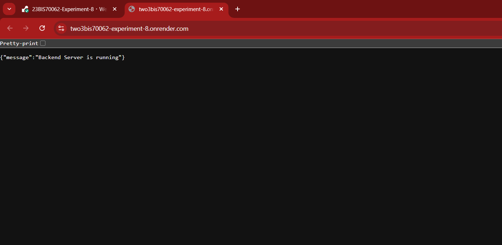
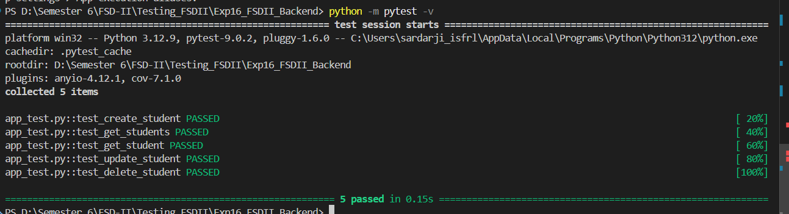
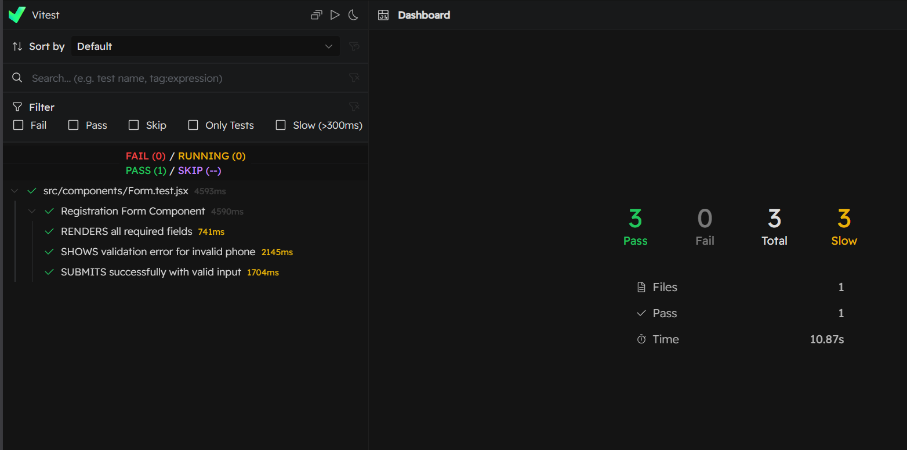
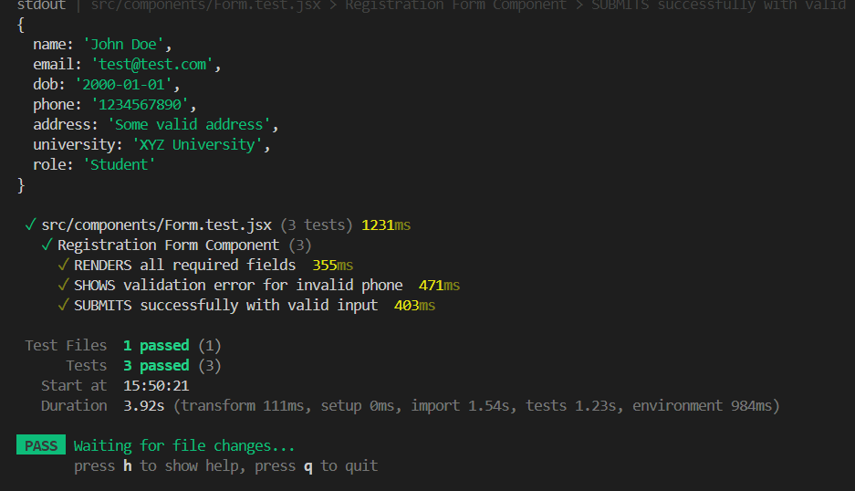
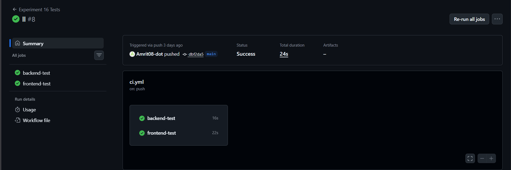
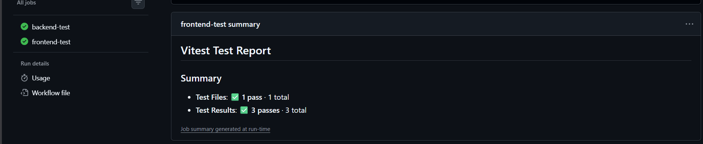

# 🚀 Full Stack Unit Testing Project (FSD-II)

### Experiment No. 16: Perform Unit Testing for Frontend & Backend Modules

---

## 🎯 Aim

To implement unit testing for backend APIs (Flask) and frontend modules using automated testing frameworks.

---

## 📁 Experiment Structure

```
Testing_FSDII/
│
├── Exp16_FSDII_Backend/
│   ├── app.py
│   ├── app_test.py
│   ├── routes/
│   ├── run.py
│   ├── requirements.txt
│   ├── htmlcov/
│   └── .coverage
│
├── Exp16_FSDII_Frontend/
│   ├── src/
│   │   └── components/
│   │       ├── Form.jsx
│   │       └── Form.test.jsx
│   ├── public/
│   ├── package.json
│   ├── vite.config.js
│   └── README.md
│
├── Screenshots/
└── README.md
```

---

## ⚙️ Technologies Used

### Backend

- Python
- Flask
- Pytest
- Pytest-Cov

### Frontend

- React (Vite)
- Vitest
- React Testing Library
- Material UI

---

# 🧠 Theory

### 🔹 Importance of Testing

- Improves reliability
- Prevents regressions
- Ensures correctness

### 🔹 Types of Testing

- Unit Testing
- Integration Testing
- System Testing
- Acceptance Testing

---

# ⚙️ Backend Testing (Flask + Pytest)

## ✔️ What was implemented

- REST API for student management
- CRUD operations tested:
  - Create student
  - Get all students
  - Get student by ID
  - Update student
  - Delete student

## 🧪 Test Implementation

- Used `pytest`
- Used Flask test client:

```python
@pytest.fixture
def client():
    app.testing = True
    return app.test_client()
```

## ▶️ Run Backend Tests

```bash
pytest -v
```

## 📊 Coverage Report

```bash
pytest --cov=app --cov-report=term-missing --cov-report=html
```

Open:

```
htmlcov/index.html
```

---

# ⚛️ Frontend Testing (Vitest + React Testing Library)

## ✔️ What was implemented

- Registration Form UI
- Input validation:
  - Name validation
  - Age (DOB) validation
  - Phone validation
  - Address validation
  - Role selection validation

## 🧪 Test Cases

- Render all fields
- Validate incorrect input
- Successful form submission

## 🔧 Tools Used

- Vitest → test runner
- React Testing Library → DOM testing
- jsdom → browser simulation

## ▶️ Run Frontend Tests

```bash
npm install
npm run test
```

OR:

```bash
npx vitest
```

---

## ⚠️ Challenges Faced

### 1. Material UI Label Issues

- MUI generates complex DOM structure
- Caused multiple matches in tests

### 2. Query Conflicts

- "Name" and "University Name" caused ambiguity

### ✔️ Solution

- Used `getAllByRole()` instead of `getByLabelText()`
- Indexed elements properly

---

## 🧪 Example Frontend Test

```javascript
const name = screen.getAllByRole("textbox", { name: /name/i })[0];
fireEvent.change(name, { target: { value: "John Doe" } });
```

---

# 📸 Screenshots

### Backend Server Test



### Backend Test



### Frontend Tests



### Frontend Report



### Github Actions





# 📚 Learning Outcomes

- Learned backend unit testing using Flask and Pytest
- Understood API testing using test client
- Learned frontend testing using Vitest
- Understood DOM-based testing using React Testing Library
- Gained experience debugging real-world issues
- Learned importance of test coverage

---

# ⚠️ Known Issues

- Backend uses in-memory storage
- Minor UI testing complexity due to Material UI
- No database integration

---

# ⭐ Future Improvements

- Add database (SQLite/PostgreSQL)
- Implement authentication
- Add integration testing
- CI/CD pipeline for automated testing
- Dockerize application

---

# 👨‍💻 Author

Amrit Singh
23BIS70062
